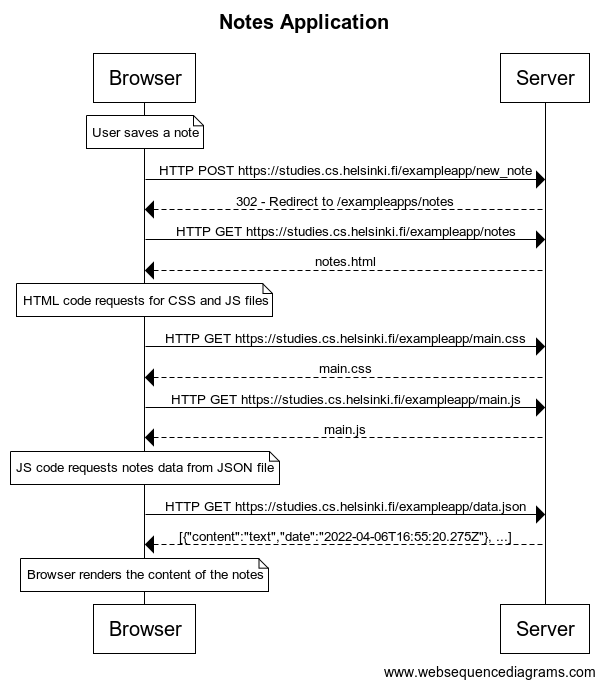

# Fundamentos de las aplicaciones web

## Lista de ejercicios
Enlace: https://fullstackopen.com/es/part0/fundamentos_de_las_aplicaciones_web#ejercicios-0-1-0-6

## Soluciones

### 0.4 - Nueva nota

[Click](./04.txt) para ver en texto.

### 0.5 - Aplicación de una sola página

[Click](./05.txt) para ver en texto.

### 0.6 - Nueva nota (SPA)

[Click](./06.txt) para ver en texto.